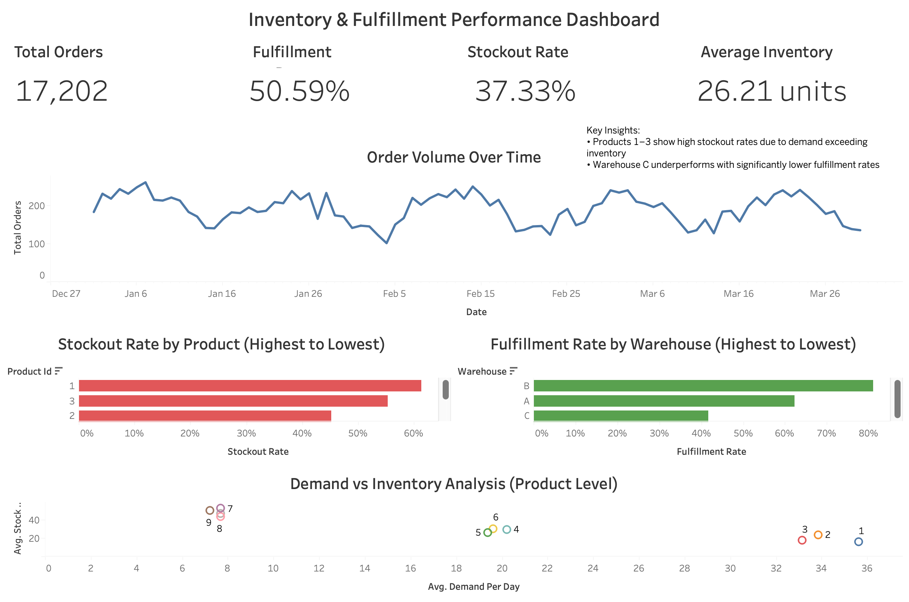

# Inventory and Fulfillment Performance Dashboard

## Overview

This project analyzes inventory performance, demand patterns, and warehouse fulfillment efficiency using simulated supply chain data.

The goal is to identify stock imbalances, reduce stockouts, and evaluate operational performance across products and warehouses.

## Tools & Technologies

- Python (Pandas, NumPy)
- Data Simulation & Analysis
- Tableau (Dashboard & Visualization)
- CSV Data Processing

## Dataset

The dataset was generated using Python to simulate real-world supply chain conditions, including:

- Multiple products with varying demand levels (high, medium, low)
- Seasonal demand fluctuations
- Inventory depletion and restocking logic
- Warehouse-level fulfillment performance differences
- Stockout scenarios

Each row represents a single unit of demand, enabling detailed order-level analysis.

## Dashboard Features

- Daily Order Volume Trend
- Stockout Rate by Product
- Warehouse Fulfillment Performance
- Demand vs Inventory Analysis
- Key Performance Indicators (KPIs):
  - Total Units Sold
  - Fulfillment Rate
  - Stockout Rate
  - Average Inventory Level

## Key Insights

- High-demand products experienced elevated stockout rates due to insufficient inventory levels
- Low-demand products were consistently overstocked, indicating inefficient inventory allocation
- Warehouse performance varied significantly, with one location consistently underperforming in fulfillment rate
- Demand vs. inventory analysis highlighted clear mismatches between supply levels and actual demand patterns
  
## Business Impact

- Reduced stockout occurrences for high-demand products from 62 to 42 days (~32% improvement)
- Identified inventory imbalances across product categories, supporting improved allocation strategies
- Detected underperforming warehouse operations, enabling targeted operational improvements

## Dashboard Preview

## Live Dashboard

View the interactive dashboard here: [https://public.tableau.com/app/profile/byron.moreira/viz/InventoryFulfillmentDashboard/InventoryFulfillmentPerformanceDashboard?publish=yes]

## How to Run

1. Run the Python script to generate the dataset
2. Open the dataset in Tableau
3. Load the dashboard file (.twbx)

## Project Objective

This project demonstrates the application of data analytics to solve real-world supply chain and inventory management problems.

## Author

Byron Moreira

B.Sc. in Computer Applications, Mathematics & Statistics
